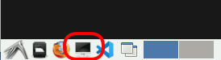

# swinburne_tools
Tools specific to users associated with Swinburne University of Technology

# Creating a Nectar VM and connecting to the Ozstar filesystem
Go to https://desktop.rc.nectar.org.au/home/

Select 'Login VIA AAF (Australia)' or 'Australia Access Federation'

Select your organisation

Login (if necessary)

Select 'Neurodesktop' from the 'Desktop Library' (you may have to scroll down to see it)

Click '+Create Desktop'

Keep the 'Default zone' and click 'Create'

...wait....

Click 'Open Desktop'

If you get a pop-up window 'See txt and images copied to the clipboard', click 'Allow'.

Once the VM has started, click on the 'LXTerminal' icon at the bottom left corner of the browser window.



Run the following line in the terminal (use Ctrl-Shift-v to paste), and enter your <ins>ozstar</ins> username and password when prompted:

```
curl -Ls https://raw.githubusercontent.com/SwinburneNeuroimaging/swinburne_tools/main/ozstar_setup.sh > /tmp/tmp.sh; bash /tmp/tmp.sh
```
This only has to be run once when the virtual machine is created. 

Sometimes the connection to the ozstar filesystem will be dropped (this will happen if the machine gets 'shelved' for instance). You can run the command 
```
reconnect_ozstar
```
in a terminal to reconnect to ozstar at any time.

# Using the mne coreg utility

1. This first step only needs to be done once on a new virtual machine. Click on the menu button on the bottom left corner of the screen and navigate to the 'mneextended 1.1.0' link. 


Clicking on this will open a terminal and a new container will be downloaded. When this has finished, close this terminal.

2. Open a new terminal (see 'LXTerminal' above) and copy and paste the following:

   ```
   apptainer  shell --bind /fred,/dagg/public/neuro,/home /cvmfs/neurodesk.ardc.edu.au/containers/mneextended_1.1.0_20220819/mneextended_1.1.0_20220819.simg
   ```
3. Then copy and paste the following:
   ```
   source /opt/miniconda-4.7.12/etc/profile.d/conda.sh
   conda activate mne-extended
   ```
4. Finally, start the mne coregistration gui with the following, where ```SUBJECTS_DIR``` should be something like ```/fred/ozxxx/freesurfer/subjects```
   ```
   mne coreg -d SUBJECTS_DIR
   ```
   You can also do ```mne coreg --help``` for other command line options. [Note this can take a long time to start]
